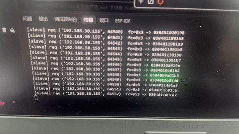
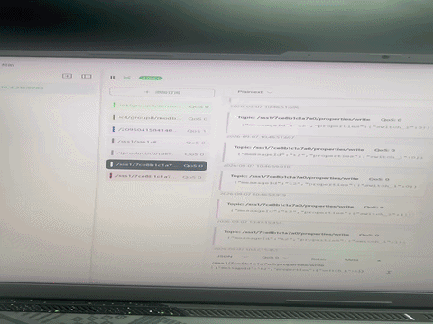

# ESP32 继电器 + Modbus 网关（JetLinks 接入）

物联网项目，软硬结合：用 ESP32-C3 控制继电器、做 Modbus 网关，通过 MQTT 接入 JetLinks 平台；另外用 Python 模拟了几台设备，没有硬件的时候也能跑通整条链路。

## 整体链路

设备 → MQTT / Modbus → JetLinks 平台 → 下行控制 → 回到设备

- 硬件这边：ESP32-C3 按键切继电器、状态经 MQTT 上报；平台或 MQTTX 下发指令控制继电器亮灭
- 网关这边：ESP32 周期轮询 Modbus 从站寄存器，转成 JSON 上报
- 软件这边：温湿度传感器、Modbus 采集器、继电器三台设备，用 Python 模拟

## 硬件（firmware/ 目录）

ESP32-C3，4 路真实继电器（GPIO 3/4/5/7），4 个按键（GPIO 10/9/6/8），刷 MicroPython v1.24。

- relay8_mqtt.py —— 固件：配网、按键切继电器、MQTT 上报、Modbus 网关、分时调度
- relay8_操作说明.md —— 引脚、刷机、配网、协议、测试的说明，看不懂固件先看这个
- test_relay8_mock.py —— 不接硬件的离线自测（54 项断言）
- modbus_tcp_slave.py —— 电脑端模拟 Modbus 从站，给网关采集用

## 软件模拟（根目录）

三台设备，每个脚本独立运行，共用 config.py、mqtt.py、jetlinks.py：

- sensor_simulator.py —— 温湿度传感器
- modbus_collector.py —— Modbus-TCP 采集器
- relay_simulator.py —— 8 路继电器
- modbus_slave_sim.py —— 本地 Modbus 从站，离线测试采集器用

## 演示





## 快速开始

软件模拟（Python 3.9+）：

```bash
pip install -r requirements.txt
copy .env.example .env
python sensor_simulator.py
```

硬件（ESP32-C3）：先刷 MicroPython 固件，再用 Thonny 打开 firmware/relay8_mqtt.py，另存为 main.py 到设备后重启。详细步骤见 firmware/relay8_操作说明.md。

## 技术栈

Python、paho-mqtt、pymodbus、MicroPython、JetLinks、EMQX、ESP32-C3
